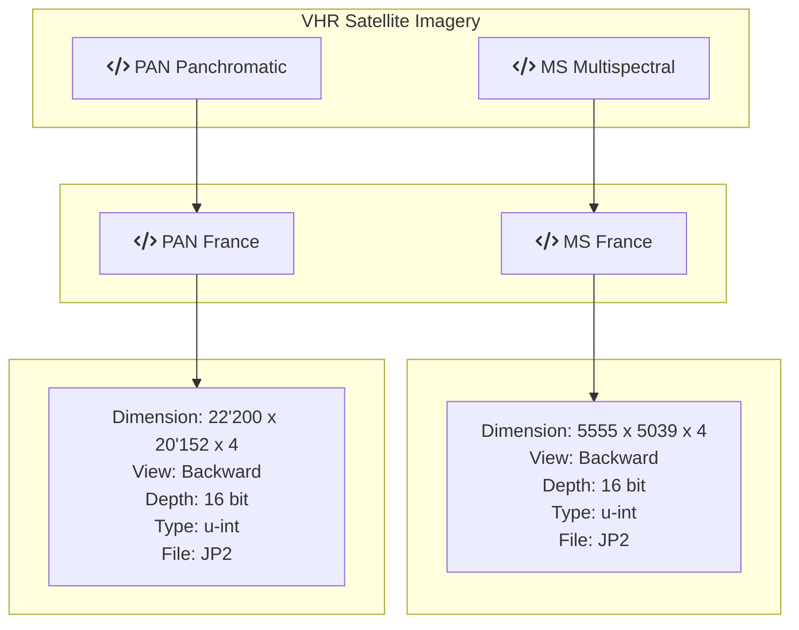

Single View very-high Resolution Satellite Imagery Overview
------------------------------------------------------------
------------------------------------------------------------
DippoldEJ Satellite Datasets Pleiades Multispectral France Panchromatic  very-high Resolution (VHR)   

