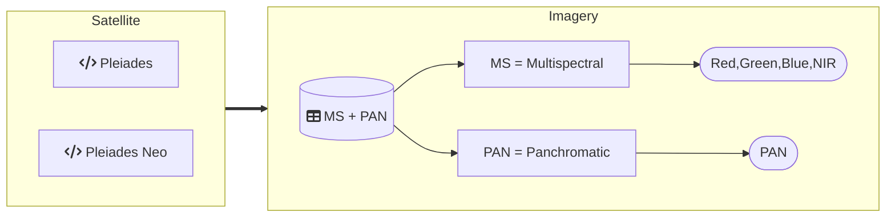

Satellite-Datasets Overview
-------------------------
-------------------------
DippoldEJ Satellite Datasets Pleiades Multispectral France Panchromatic  
Methodology: Preprocesing, Bands, Band Combinations and Area of Interest (AOI) gif

Structure:  

Pleiades 1B
------------

Pléiades 1B is belonging to the European Space Agency (ESA). The Panchromatic band reaches a resolution of 0.5m while the Multispectral bands reaches 2m resolution. As a result, Pléiades is a satellite with very-high resolution (VHR) imagery.  

The images are captured as tristereo, as show in Figure 1. In addition, the determination of the direction of each image can be found out based on the incidence angle. 

   

Figure 1: Pléiades Panchromatic tristereo. The images are captured in pairs, so that they overlap. This is an advantage especially in the city where the likelihood of building canyons is likely, as shown in the figure above (Panagiotakis et al., 2018).   

References
-----------
Panagiotakis, E., Chrysoulakis, N., Charalampopoulou, V., Poursanidis, D., 2018. Validation of Pleiades Tri-Stereo DSM in Urban Areas. International Journal of Geo-Information 7.

