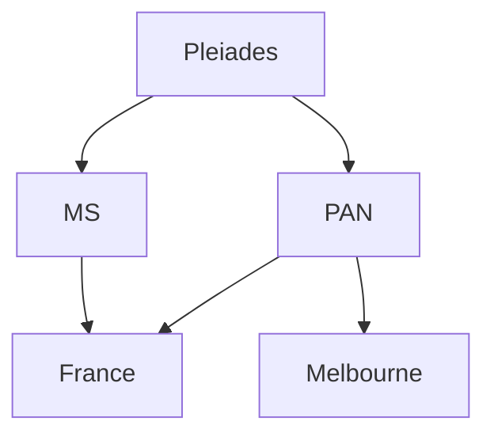
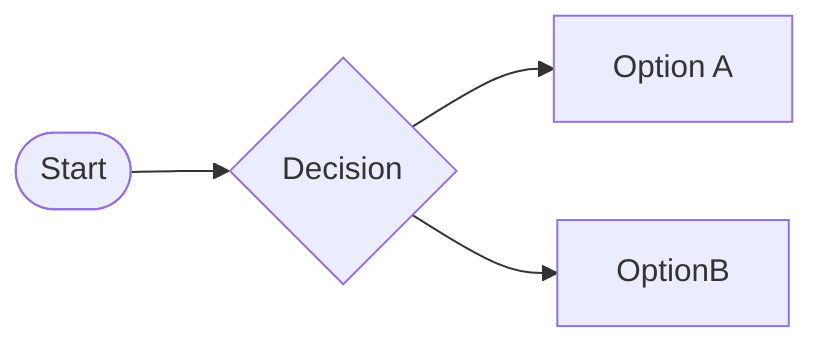
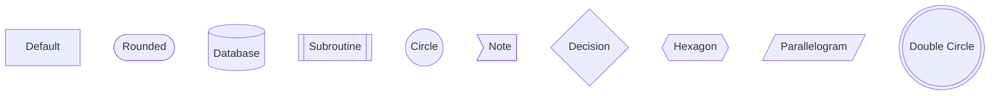
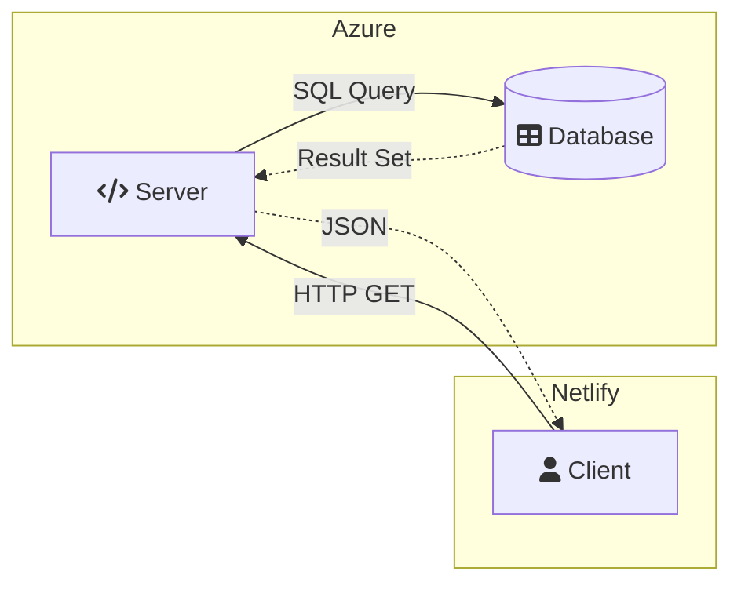
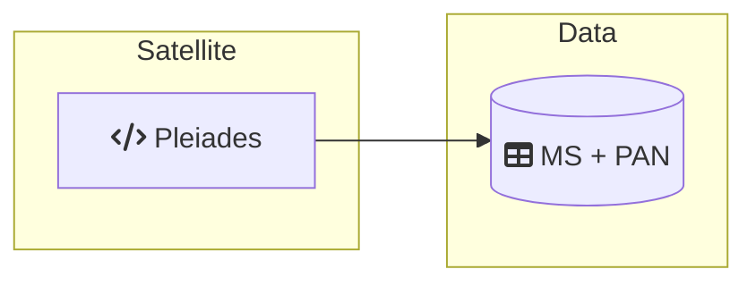

Satellite-Datasets Overview
-------------------------
-------------------------
DippoldEJ Satellite Datasets Pleiades Multispectral Panchromatic France Melbourne

Structure:  

Pleiades
------------

