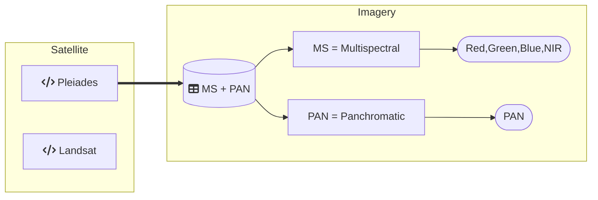

Satellite-Datasets Overview
-------------------------
-------------------------
DippoldEJ Satellite Datasets Pleiades Multispectral France Panchromatic  
Methodology: Preprocesing, Bands, Band Combinations and Area of Interest (AOI) gif, 

Structure:  

Pleiades 1B
------------

Pléiades 1B is belonging to the European Space Agency (ESA). The Panchromatic band reaches a resolution of 0.5m while the Multispectral bands reaches 2m resolution. As a result, Pléiades is a satellite with very-high resolution (VHR) imagery.  

