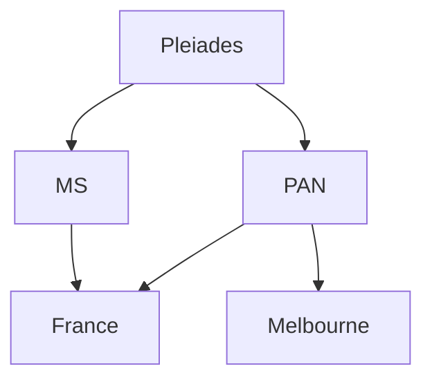

Satellite-Datasets Overview
-------------------------
-------------------------
DippoldEJ Satellite Datasets Pleiades Multispectral Panchromatic France Melbourne


Structure: <br />



```mermaid
A(["Start"])
A -->B{Decision}
B -->C["Option A"]
B -->D["OptionB"]
```


Pleiades
------------

