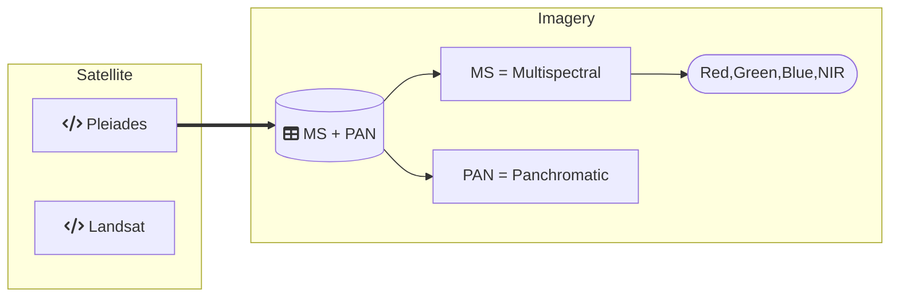

Satellite-Datasets Overview
-------------------------
-------------------------
DippoldEJ Satellite Datasets Pleiades Multispectral France Panchromatic Melbourne  
Methodology: Area of Interest (AOI), Features (Points, Edges, Corners)

Structure:  

Pleiades 1B
------------

